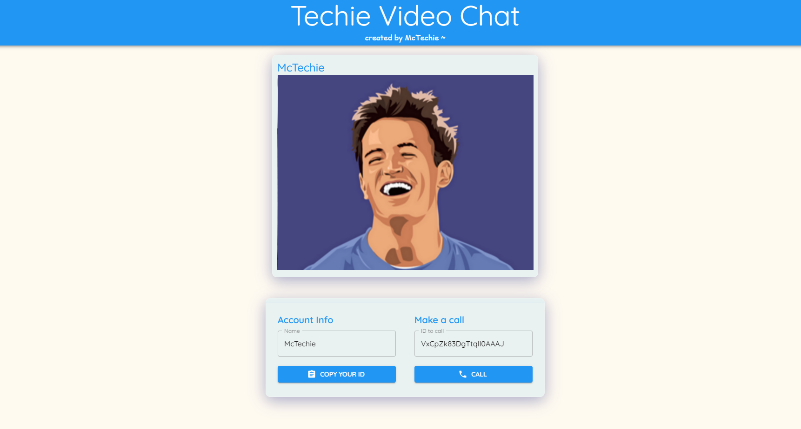
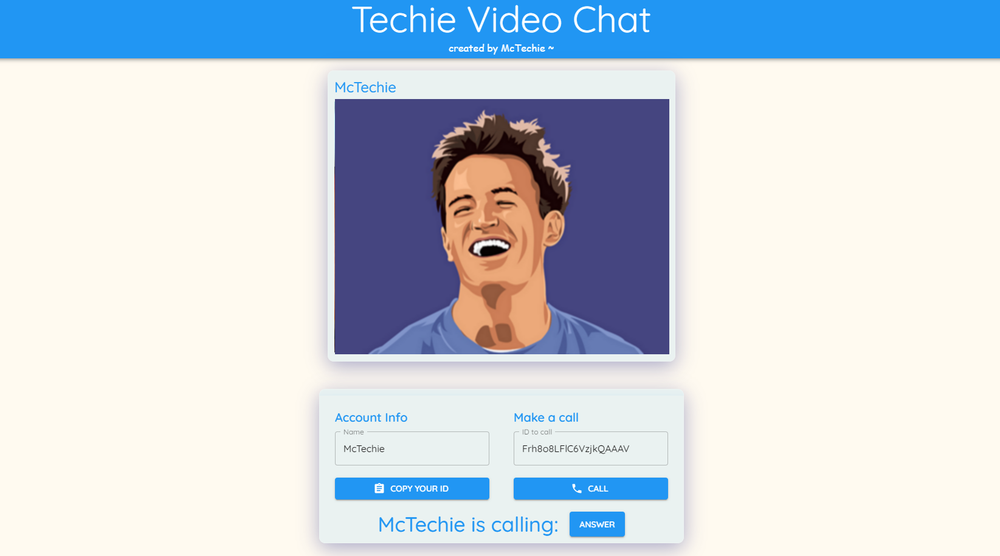
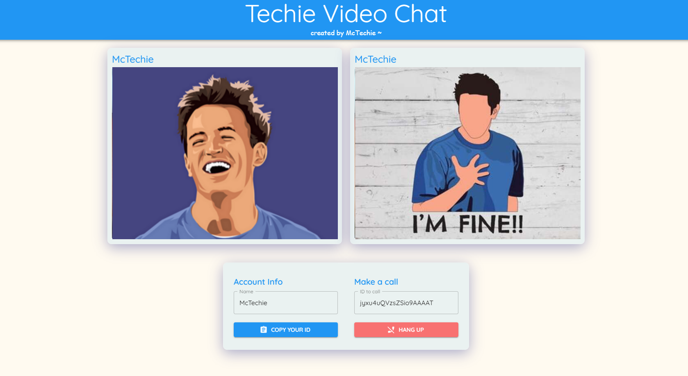

# Techie Video Chat Application

> A **McTechie** creation 👨‍🎨✨

### Tech Used

- [x] **[React.js](https://reactjs.org/)**
- [x] **[Material UI](https://material-ui.com/)**
- [x] **[Socket.io Client](https://socket.io/)**

---

### Concepts Covered

- [x] Sockets (Client-Server Communication)
- [x] WebRTC

Check out the [Server-Side](https://github.com/McTechie/techie-video-chat-server) of the application too!

---

### Landing Page

---

### Receiving a Call

---

### Receiving a Call

---